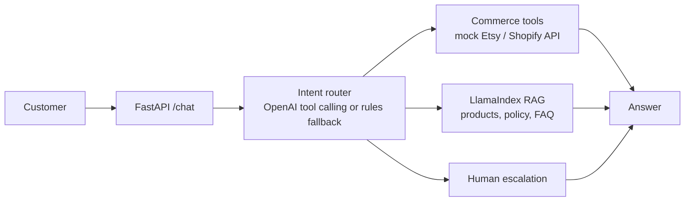

# Ecommerce RAG Agent

A tool-augmented ecommerce customer-support agent for an Etsy-like shop.

The goal is not to answer every question with RAG. The agent routes each customer message to the best source of truth:

| Question type | Route |
|---|---|
| Product count / listing count | Mock Etsy or Shopify commerce API |
| Order status / tracking | Mock Etsy or Shopify order API |
| Shipping, returns, FAQ, product suitability | LlamaIndex RAG over `data/*.md` |
| Angry customer or refund dispute | Human escalation |

By default, the router uses OpenAI tool calling when `OPENAI_API_KEY` is present. For local deterministic testing, set `AGENT_ROUTER=rules`.

## Architecture



## Run The API

Create an `.env` file:

```bash
OPENAI_API_KEY=your_api_key_here
# optional for deterministic local testing:
# AGENT_ROUTER=rules
```

Install dependencies:

```bash
python3.11 -m venv venv
source venv/bin/activate
pip install -r requirements.txt
```

Start the backend:

```bash
uvicorn api:app --reload
```

## Run The Frontend

In a second terminal:

```bash
cd frontend
python3 -m http.server 5173
```

Open `http://127.0.0.1:5173`.

Send a chat request:

```bash
curl -X POST http://127.0.0.1:8000/chat \
  -H "Content-Type: application/json" \
  -d '{"message":"how many products do you have?","platform":"etsy"}'
```

## MVP Demo Scenarios

| Scenario | Example question | Expected route |
|---|---|---|
| Product count | `how many products do you have?` | `PRODUCT_COUNT` -> commerce API |
| Order lookup | `where is order #1001?` | `ORDER_STATUS` -> commerce API |
| Policy question | `can I return my purchase?` | `RAG` -> policy knowledge base |
| Product recommendation | `I have frizzy hair, which product should I get?` | `RAG` -> product knowledge base |
| Escalation | `this is unacceptable, I want a refund dispute reviewed` | `ESCALATE` -> human handoff |

## Why API + RAG

Product counts, prices, inventory, order status, and tracking are live operational facts. They should come from Etsy, Shopify, or another commerce API.

Policies, FAQs, and product education are better suited to RAG because they are explanation-heavy and can be grounded in curated store knowledge.

This split is the core system-design decision:

- Use tools/API for exact, changing business data.
- Use RAG for semantic customer-support knowledge.
- Use escalation when the request is emotional, high-risk, or needs human judgement.

## Current Status

- FastAPI `/chat` endpoint implemented.
- Intent router supports OpenAI tool calling, with rule-based fallback for local testing.
- Mock commerce tools implemented for listing count and order lookup.
- LlamaIndex RAG retained for policy, FAQ, and recommendation questions.
- Human escalation route implemented as a safe handoff response.
- Minimal dependency-free chat UI implemented under `frontend/`.

## Troubleshooting

If RAG requests try to download NLTK resources and fail with an SSL certificate error, make sure you are running the latest code. The RAG pipeline uses `TokenTextSplitter` so local chunking does not depend on downloading NLTK `stopwords` or `punkt_tab`.

You may still see a Pydantic `UnsupportedFieldAttributeWarning` from a transitive dependency during startup. It is a warning from the dependency stack and does not block the API response.

## Credits

- RAG framework: [LlamaIndex](https://github.com/run-llama/llama_index)
- Store knowledge generation: [store2knowledge-skill](https://github.com/lingyun1010/store2knowledge-skill)
- Ecommerce RAG implementation: [eCommenceRAG](https://github.com/lingyun1010/eCommenceRAG)
