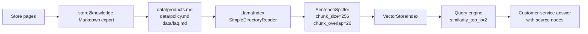

# eCommenceRAG

An ecommerce RAG customer-service prototype （taking an example with muraritual.com), built with LlamaIndex and OpenAI models.

The app uses Markdown/Txt/PDF knowledge files generated from store content, then builds a local vector index so a customer can ask natural-language questions about products, budgets, shipping, returns, and product suitability.

## What This Project Does

This repo turns structured ecommerce knowledge into a lightweight CLI customer-service assistant:

1. `data/products.md` contains product names, categories, prices, variants, and usage notes.
2. `data/policy.md` contains shipping, returns, refunds, exchanges, cancellations, and contact information.
3. `data/faq.md` contains customer-facing FAQ answers.
4. `app.py` loads those Markdown files with LlamaIndex, chunks them, embeds them, builds a vector index, and answers customer questions with source nodes printed for inspection.

## How It Works



## Run Locally

Create an `.env` file with your OpenAI API key:

```bash
OPENAI_API_KEY=your_api_key_here
```

Install dependencies:

```bash
python3.11 -m venv venv
source venv/bin/activate
pip install -r requirements.txt
```

Run the app:

```bash
python app.py
```

Type `exit` to quit the chat loop.

## Example Run

The table below summarises a local run against the current MURA knowledge files.

| Customer question | Assistant answer | Retrieved source | What it demonstrates |
|---|---|---|---|
| How many products do you have? | There are three products listed. | `data/products.md` | Product-count questions are grounded in the product knowledge file, although this answer shows a current retrieval limitation because the product table contains more than three rows. |
| I only have $40 budget, what can I get? | The assistant recommends individual 30g shampoo bar variants at $14 AUD and notes that the Herbal Scalp Massage Comb is over budget at $54 AUD. | `data/products.md` | Budget-aware product recommendation using prices and variants from structured product rows. |
| Can I return my purchase? | The assistant explains return eligibility, including item condition, original packaging, proof of purchase, and EU cancellation details. | `data/policy.md` | Policy retrieval from returns, cancellations, refunds, and contact sections. |
| How is the shipping fee? | Shipping rates are calculated at checkout, with free shipping over $50 AUD within Australia and New Zealand. | `data/policy.md` | Shipping-policy lookup with threshold-based free-shipping information. |
| I have frizzy hair, which products should I get? | The assistant recommends the CLOVE BLOSSOM Smoothing Shampoo Bar for dry, frizzy, coarse, tangled, or hard-to-manage hair. | `data/products.md` | Product matching based on customer hair concern and product usage notes. |
| What is your herbal scalp massage comb made of? | It is made from a concentrated blend of traditional herbs. | `data/products.md` | Product-attribute lookup from the product description. |
| What traditional herbs specifically? | The assistant says the specific traditional herbs are not detailed in the provided information. | `data/products.md` | A useful refusal when the retrieved knowledge does not contain the specific detail. |

## RAG Handling Beyond A Basic LlamaIndex Call

This project still uses LlamaIndex as the retrieval and indexing framework, but the RAG behaviour is shaped by our own ecommerce knowledge preparation and retrieval choices.

The main difference is that the app does not index raw website pages directly. The source content is first converted into structured Markdown by `store2knowledge`, which separates product catalogue data, policies, and FAQs into focused files. This gives the retriever cleaner product names, prices, variants, usage notes, shipping rules, and return-policy sections to work with.

The code also makes a few deliberate RAG choices:

- It uses `SimpleDirectoryReader("data")` so only curated knowledge files are indexed.
- It sets `OpenAIEmbedding(model="text-embedding-3-small")` explicitly for embeddings.
- It sets `OpenAI(model="gpt-4o-mini")` explicitly for answer generation.
- It chunks documents with `SentenceSplitter(chunk_size=256, chunk_overlap=20)` to keep product and policy context small enough for targeted retrieval.
- It uses `similarity_top_k=2` so each answer is based on the two most relevant retrieved chunks.
- It prints each answer's source nodes and metadata, making it easier to debug whether the model answered from the right product or policy file.

So the LlamaIndex call provides the RAG engine, while this repo contributes the ecommerce-specific knowledge pipeline: structured store data, customer-service-oriented Markdown, retrieval settings, and source-node inspection.

## Current Limitations

- The current CLI rebuilds the index on each run instead of persisting it.
- Answers depend on what exists in `data/*.md`; if a product ingredient or policy detail is missing, the assistant should say so.
- Product-count questions may need a more deterministic tool or structured parser because vector retrieval is not ideal for exact counting across a full catalogue.
- The app currently runs as an interactive terminal prototype rather than a deployed web chat.

## Credits

- RAG framework: [LlamaIndex](https://github.com/run-llama/llama_index)
- Store knowledge generation: [store2knowledge-skill](https://github.com/lingyun1010/store2knowledge-skill)
- Ecommerce RAG implementation: [eCommenceRAG](https://github.com/lingyun1010/eCommenceRAG)
