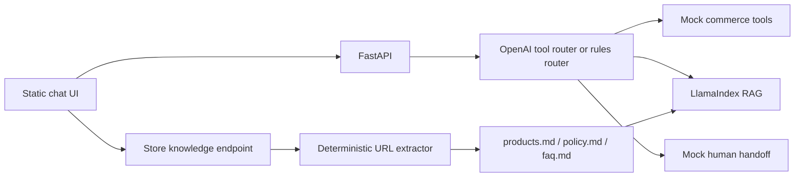

# Ecommerce RAG Agent - Project Context

Last verified: 2026-06-18 (Australia/Sydney)

This document is the handoff source for a new Codex agent. It was produced by
inspecting the local repository, Git history, key source files, and the GitHub
pull request API. Repository code is the source of truth.

## Fact Labels

- **Confirmed**: verified in the repository or GitHub API.
- **Current PR only**: present at the checked-out commit but not yet merged into
  `main`.
- **User-confirmed**: explicitly stated by the project owner.
- **TBD / needs verification**: not proven by the repository or current checks.

## 1. Project Goal And Business Scenario

### Problem

**Confirmed:** This project is an ecommerce customer-support agent that routes
questions to the appropriate source of truth instead of answering everything
with RAG:

| Customer request | Intended route |
|---|---|
| Product/listing count | Commerce API tool |
| Order status and tracking | Commerce API tool |
| Product education, recommendations, shipping, returns, FAQ | LlamaIndex RAG |
| Angry customer, chargeback, refund dispute, human request | Human escalation tool |

The MVP uses an Etsy-like or Shopify-like store context. Operational values are
currently mock data, while explanatory answers use Markdown knowledge files.

### Target Users And Scenarios

- Small ecommerce teams that need a support assistant.
- Etsy or Shopify merchants who want store knowledge plus live operational
  lookups.
- Customer-support demonstrations covering product discovery, policy questions,
  order tracking, listing counts, and escalation.

### Portfolio Value

**User-confirmed:** The owner is using this project to transition from software
engineer to AI engineer.

It demonstrates more than a chatbot:

- RAG retrieval over business-owned knowledge.
- LLM tool selection and deterministic fallback routing.
- Separation of static knowledge from changing operational state.
- API and frontend integration.
- Grounding, escalation, and failure-mode design.
- A path from mock tools to real Etsy/Shopify integrations.

## 2. Current Technology Stack And Architecture

### Backend

- Python `>=3.10` in `pyproject.toml`; Python 3.11 is the recommended runtime.
- FastAPI `0.115.14`.
- Uvicorn `0.34.3`.
- Pydantic models through FastAPI.
- A CLI entrypoint remains available in `app.py`.

### Frontend

- Dependency-free HTML, CSS, and JavaScript under `frontend/`.
- Served locally with Python's static HTTP server on port `5173`.
- Calls FastAPI at `http://127.0.0.1:8000` unless
  `window.AGENT_API_URL` is set.
- This is not a React application, despite the historical ticket filename
  `004-react-chat-ui.md`.

### LLM Provider

- OpenAI.
- Tool router model: `gpt-4o-mini`.
- RAG answer model: `gpt-4o-mini`.
- Embedding model: `text-embedding-3-small`.
- The tool router uses OpenAI Chat Completions function/tool calling.

### RAG Layer

- LlamaIndex core and OpenAI integrations.
- `SimpleDirectoryReader` loads Markdown files.
- `TokenTextSplitter(chunk_size=256, chunk_overlap=20)` avoids runtime NLTK
  downloads.
- `VectorStoreIndex` is created in memory.
- Retrieval uses `similarity_top_k=2`.
- `get_query_engine()` is process-local and cached with `lru_cache`.
- Generated runtime knowledge under `runtime_knowledge/current/*.md` takes
  priority over checked-in demo knowledge under `data/*.md`.

### Tool Calling And API Layer

`agent_router.py` selects one of two router modes:

- OpenAI tool calling when `AGENT_ROUTER=openai` (default) and
  `OPENAI_API_KEY` is present.
- Deterministic rules otherwise, including `AGENT_ROUTER=rules`.

Available tools:

- `get_listing_count`
- `get_order`
- `escalate_to_human`

**Confirmed limitation:** These tools currently call in-memory mock data in
`commerce_api.py`, not Etsy or Shopify.

### Data And Knowledge Sources

- Checked-in curated demo knowledge:
  - `data/products.md`
  - `data/policy.md`
  - `data/faq.md`
- Runtime-generated knowledge:
  - `runtime_knowledge/current/products.md`
  - `runtime_knowledge/current/policy.md`
  - `runtime_knowledge/current/faq.md`
- Download artifacts:
  - `generated_knowledge/<artifact-id>.zip`
  - `generated_knowledge/<artifact-id>/*.md`

Runtime directories are ignored by Git.

`store_knowledge.py` is deterministic extraction code, not an AI agent. It
tries:

1. Shopify `products.json`.
2. Product JSON-LD.
3. Product/listing links in HTML.
4. Policy/contact links in HTML.
5. `Not specified` placeholders when facts cannot be extracted.

### Human Handoff

`escalate_to_human()` currently returns a mock result saying a human teammate
should review the conversation.

**Confirmed limitation:** It does not create a Zendesk ticket, send an email,
write to a database, or notify a real person.

### Request Flow



## 3. Repository, Branch And PR Information

### Repository

- Local path: `/Users/lingyunzhao/etsy-ai-agent`
- Local remote URL:
  `https://github.com/lingyun1010/eCommenceRAG.git`
- **Confirmed:** GitHub redirects this to the canonical repository
  `lingyun1010/ecommerce-rag-agent`.
- Default branch: `main`.

### Current Local Branch

- Current local branch: `chore/update-agent-files`.
- Branch base commit: `717e43f` - `Merge pull request #8 from
  lingyun1010/pr-7`.
- This branch was created from `main` for documentation-only changes.
- Local `pr-9`, local `pr-7`, and `origin/pr-7` point to commit `c877862`,
  which is the head of GitHub PR #9.

### Open Pull Requests

Verified through the GitHub API on 2026-06-18:

| PR | Title | Head -> Base | Status |
|---|---|---|---|
| [#9](https://github.com/lingyun1010/ecommerce-rag-agent/pull/9) | Make store knowledge generation tolerant | `pr-7` -> `main` | Open |
| [#2](https://github.com/lingyun1010/ecommerce-rag-agent/pull/2) | Handle product count questions deterministically | `fix-python-version-requirement` -> `main` | Open |

PR #2 appears stale because later merged work already implements product-count
routing. Confirm on GitHub before closing it.

### Main Branch Status

- Local `main` and `origin/main` both point to `717e43f`.
- That commit is `Merge pull request #8 from lingyun1010/pr-7`.
- `main` includes split knowledge generation from commit `86ff778`.
- **Current PR only:** tolerant URL/fetch fallback from commit `c877862` is one
  commit beyond `main` and is covered by PR #9.

### Experimental Branches

- No local or remote branch named `langgraph-v2` was found.
- No LangGraph or LangChain dependency/import was found.
- A LangGraph V2 experiment is therefore **TBD / needs verification**, not an
  existing plan recorded in this repository.

## 4. Key Directories And File Responsibilities

| Path | Responsibility |
|---|---|
| `api.py` | FastAPI app, request/response models, CORS, chat endpoint, knowledge generation, ZIP download |
| `app.py` | Interactive CLI that calls the same agent router |
| `agent_router.py` | Rule-based intent classification and OpenAI-vs-rules router selection |
| `openai_tool_router.py` | OpenAI tool schemas, tool execution, tool-result formatting, RAG fallback |
| `commerce_api.py` | In-memory mock listings, orders, and escalation result |
| `rag_service.py` | LlamaIndex loading, chunking, indexing, retrieval, source-node response |
| `store_knowledge.py` | Deterministic store URL extraction, three Markdown renderers, artifact ZIP creation |
| `data/products.md` | Curated product knowledge used by the default RAG demo |
| `data/policy.md` | Curated policy knowledge |
| `data/faq.md` | Curated FAQ knowledge |
| `frontend/index.html` | Store setup and chat UI structure |
| `frontend/app.js` | API requests, UI state, demo prompts, tool/source rendering |
| `frontend/styles.css` | Responsive minimal UI styling |
| `AGENTS.md` | Persistent Codex working rules, test expectations, and constraints |
| `docs/decision-log.md` | Architecture decisions, reasons, trade-offs, and status |
| `docs/setup-notes.md` | Environment, run, test, curl, and troubleshooting notes |
| `docs/tickets/` | Historical implementation tickets 002-005 |
| `requirements.txt` | Fully pinned Python runtime dependencies |
| `pyproject.toml` | Project name, version `0.2.0`, Python `>=3.10` |
| `.env` | Local secrets/config; ignored by Git and must never be committed |
| `.gitignore` | Ignores secrets, venv, caches, and generated knowledge |
| `README.md` | Public project overview and run instructions; currently has one stale store-generation paragraph |
| `generated_knowledge/` | Ignored ZIP and Markdown download artifacts |
| `runtime_knowledge/` | Ignored active generated RAG knowledge |

No automated test directory, deployment config, Dockerfile, or CI workflow was
found.

## 5. Completed Features And Important Changes

### Implemented Endpoints

| Method | Endpoint | Purpose |
|---|---|---|
| `GET` | `/health` | Returns `{"status":"ok"}` |
| `POST` | `/chat` | Routes a customer message and returns intent, answer, optional tool result and sources |
| `POST` | `/knowledge/generate` | Generates three Markdown knowledge files from a store URL |
| `GET` | `/knowledge/download/{artifact_id}` | Downloads the generated files as ZIP |

### RAG

- Loads curated or runtime Markdown knowledge.
- Uses OpenAI embeddings and LLM through LlamaIndex.
- Returns retrieved source text and file metadata to the frontend.
- Uses token-based splitting without NLTK downloads.
- Clears the cached query engine after new knowledge is generated.

### Tool Calling

- OpenAI tool schemas exist for listing count, order lookup, and escalation.
- The model can select a tool automatically.
- The rule router remains available for deterministic offline routing tests.
- If OpenAI selects no tool, the request goes to RAG.

### Store Knowledge Fallbacks

**Confirmed on current commit / PR #9:**

- Missing URL scheme is normalized to `https://`.
- A browser-like user agent and accept headers are used.
- Product extraction can use Shopify JSON, JSON-LD, or product links.
- If a store page cannot be fetched, three placeholder files are still
  generated and a warning is returned.
- Unknown values are written as `Not specified`; facts are not invented.
- Output files are `products.md`, `policy.md`, and `faq.md`.
- Downloads are ZIP files.

### Frontend

- Store URL setup screen.
- Generate-knowledge action and status message.
- ZIP download link.
- Enter-chat action after generation.
- Demo-data bypass.
- Etsy/Shopify selector.
- Demo prompts for all four routing paths.
- Intent badge, expandable tool result, and expandable RAG sources.
- Responsive vanilla CSS.

### Documentation

- README includes architecture, route matrix, run commands, demo scenarios,
  troubleshooting, and credits.
- Tickets 002-005 record the evolution from deterministic routing to tool
  calling, UI, and store ingestion.
- Credits include LlamaIndex and `store2knowledge-skill`.

**Documentation gap:** README still says generated knowledge is written to a
single `data/store_knowledge.md`. Current code writes three files under
`runtime_knowledge/current/` and creates a ZIP. Update README after PR #9 is
settled.

## 6. Technical Decisions And Reasons

### Why FastAPI

**Confirmed by implementation; rationale consistent with the MVP:**

- Small typed API surface.
- Easy Pydantic request/response validation.
- Simple local development with Uvicorn.
- Natural integration point for a separate frontend and future platform
  webhooks.

### Why OpenAI Tool Calling

- Lets the model select structured operational tools.
- Tool schemas make the boundary between live state and language generation
  explicit.
- Tool results can be shown and audited.
- The rule fallback keeps local testing deterministic.

### Why LlamaIndex RAG

- The project began as a LlamaIndex RAG application.
- It provides file loading, chunking, embeddings, vector indexing, retrieval,
  LLM synthesis, and source nodes with little orchestration code.
- It is appropriate for product education, policies, and FAQs.

### Why Not LangChain/LangGraph In V1

**Confirmed:** Neither is currently installed or imported.

**Inferred rationale; no explicit architecture decision record exists:** The V1
workflow has only a few routes and tools, so direct Python orchestration is
easier to explain, test, and demo than introducing a graph framework.

Do not claim LangGraph was rejected after an experiment; no such experiment is
recorded.

### Possible V2 Upgrades

- Real Etsy Listings/Receipts APIs or Shopify Admin API adapters.
- LangGraph only if the workflow needs durable multi-step state, retries,
  approvals, or long-running human-in-the-loop execution.
- Persistent vector database and ingestion versioning.
- Strict grounded-answer prompt and evaluation suite.
- Real support ticket creation and conversation persistence.
- Streaming responses and deployed frontend/backend.

## 7. Tried Or Failed Approaches

### Python 3.9 With Newer LlamaIndex

Observed historical failure:

```text
TypeError: unsupported operand type(s) for |: 'ModelMetaclass' and 'NoneType'
```

Cause: dependency code used Python 3.10 union syntax (`LLM | None`) while the
application was run with Python 3.9.

Do not repeat: running `python3 app.py` without confirming the interpreter.
Use Python 3.11 and verify `python --version`.

### Broken/Mixed Existing Virtual Environment

Current local evidence:

- `venv/bin/python --version` reports Python `3.9.6`.
- Installed packages are under `venv/lib/python3.11/site-packages`.
- `venv/bin/python3.11` can run the installed application.

Treat this venv as inconsistent. Rebuild it before relying on it.

### NLTK Downloads

Historical RAG chunking attempted to download `stopwords` and `punkt_tab`, then
failed with an SSL certificate verification error.

Resolution: use `TokenTextSplitter`. Do not reintroduce runtime NLTK downloads
unless certificates and offline behaviour are deliberately handled.

### Dependency Warning

The following warning still appears during import/startup:

```text
UnsupportedFieldAttributeWarning: 'validate_default' ... has no effect ...
```

It comes from the Pydantic/transitive dependency stack and did not block the
FastAPI smoke test.

### Store Fetching

Direct `urllib` extraction cannot reliably parse:

- JavaScript-rendered storefronts.
- Bot-protected pages.
- Stores requiring authentication.
- Etsy pages whose structure/API access differs from Shopify.

PR #9 changes fetch failure from HTTP 400 to placeholder output plus warning.
This improves flow resilience but does not make extraction complete.

### Frontend Framework

React was considered in future-work wording, but the implemented MVP is
dependency-free vanilla HTML/CSS/JS. Do not add React only to rename the stack;
adopt it only if UI complexity justifies migration.

### Tooling/Environment Notes

- `gh` is not installed in the checked environment.
- GitHub PR status was verified through the public GitHub API instead.
- A TestClient run initially failed because the Codex sandbox could not write
  into the repo's ignored runtime directory. Redirecting test artifacts to
  `/private/tmp` passed. This was a sandbox restriction, not an application
  failure.

## 8. Current Bugs, Blockers And Unfinished Work

### High Priority

1. **PR #9 is not merged.** The tolerant fetch behaviour is not on `main`.
2. **SSRF protection is missing.** `/knowledge/generate` accepts arbitrary
   `http`/`https` URLs and may reach loopback/private/internal addresses. Add
   hostname/IP validation and redirect validation before deployment.
3. **Commerce APIs are mocks.** Product count and order data are hard-coded.
4. **RAG grounding is not strict enough.** The query engine has no explicit
   refusal/grounding prompt or confidence threshold. The constraint is desired,
   but enforcement and evaluation are incomplete.
5. **No automated tests exist.** Only manual/smoke checks have been performed.

### Functional Gaps

- Escalation does not create a real ticket or notify a human.
- No authentication or authorization protects order lookups.
- No conversation persistence or session ID.
- No real refund-status/refund-action tool.
- No PDF or plain-text ingestion; store generation outputs Markdown only.
- No JavaScript rendering/browser ingestion for dynamic stores.
- Placeholder knowledge can unlock chat with zero real facts; UX should make
  this state more explicit.
- OpenAI tool router executes only the first tool call if the model returns
  multiple calls.
- Tool argument JSON errors are not handled explicitly.
- Synchronous store fetching may be slow because policy pages are fetched
  sequentially.

### Testing Gaps

- No unit tests for intent classification, order ID extraction, tools, URL
  validation, renderers, or fallback behaviour.
- No FastAPI contract tests committed.
- No mocked OpenAI tool-calling tests.
- No RAG retrieval/grounding evaluation dataset.
- No frontend browser tests.
- No CI.

### UX Gaps

- No streaming.
- Limited loading/progress states for potentially slow store extraction.
- Error and warning text is minimally styled.
- No individual file download links; only ZIP.
- No clear distinction between real extracted knowledge and placeholders.
- UI quality was previously acknowledged as needing refinement.

### Deployment And Operations Gaps

- No Dockerfile or deployment configuration.
- CORS only permits local port `5173`.
- No API authentication, rate limiting, logging strategy, metrics, or tracing.
- Runtime knowledge and vector index are process-local; restart/redeploy
  behaviour is not managed.
- No storage lifecycle for generated ZIP files.

### Documentation Gaps

- README store-generation details are stale.
- `docs/decision-log.md` now records decisions visible in code and README;
  original decision dates remain unknown where marked.
- No API schema examples for knowledge generation/download.
- No explicit security section.

## 9. Environment, Run And Test Commands

### Install

Use a clean Python 3.11 environment:

```bash
cd /Users/lingyunzhao/etsy-ai-agent
python3.11 --version
python3.11 -m venv venv
source venv/bin/activate
python --version
python -m pip install --upgrade pip
pip install -r requirements.txt
```

Expected `python --version`: Python 3.11.x. If it reports 3.9, rebuild the venv.

### Environment Variables

Create `.env` locally:

```dotenv
OPENAI_API_KEY=your_openai_api_key
# Optional deterministic router:
# AGENT_ROUTER=rules
```

Behaviour:

- Key present and `AGENT_ROUTER` unset or `openai`: OpenAI tool router.
- Key absent: rules router.
- `AGENT_ROUTER=rules`: rules router even if a key exists.
- RAG still requires `OPENAI_API_KEY` because embeddings and answer synthesis
  use OpenAI.

### Run Backend

```bash
source venv/bin/activate
uvicorn api:app --reload
```

Backend: `http://127.0.0.1:8000`

Interactive API docs: `http://127.0.0.1:8000/docs`

Optional CLI:

```bash
source venv/bin/activate
python app.py
```

### Run Frontend

```bash
cd frontend
python3 -m http.server 5173
```

Open `http://127.0.0.1:5173`.

### Minimum Checks

Compile Python and check the JS syntax:

```bash
python -m py_compile \
  app.py api.py agent_router.py openai_tool_router.py \
  commerce_api.py rag_service.py store_knowledge.py
node --check frontend/app.js
```

If `node` is unavailable, skip only the JS syntax command and record that it
was not run.

Rule-router smoke test:

```bash
AGENT_ROUTER=rules python - <<'PY'
from agent_router import answer_message

result = answer_message("how many products do you have?", platform="etsy")
assert result["intent"] == "PRODUCT_COUNT"
assert result["tool_result"]["active_listing_count"] == 12
print("rule router smoke test ok")
PY
```

No committed `pytest` suite currently exists.

### Example API Calls

Health:

```bash
curl http://127.0.0.1:8000/health
```

Product count:

```bash
curl -X POST http://127.0.0.1:8000/chat \
  -H "Content-Type: application/json" \
  -d '{"message":"how many products do you have?","platform":"etsy"}'
```

Order status:

```bash
curl -X POST http://127.0.0.1:8000/chat \
  -H "Content-Type: application/json" \
  -d '{"message":"where is order #1001?","platform":"etsy"}'
```

RAG:

```bash
curl -X POST http://127.0.0.1:8000/chat \
  -H "Content-Type: application/json" \
  -d '{"message":"can I return my purchase?","platform":"etsy"}'
```

Generate knowledge:

```bash
curl -X POST http://127.0.0.1:8000/knowledge/generate \
  -H "Content-Type: application/json" \
  -d '{"store_url":"https://example-store.com","output_format":"markdown"}'
```

Use the returned `download_url`:

```bash
curl -OJ http://127.0.0.1:8000/knowledge/download/<artifact-id>
```

### Common Errors And Fixes

| Symptom | Likely cause | Fix |
|---|---|---|
| `unsupported operand type(s) for \|` | Python 3.9 | Rebuild with Python 3.11 |
| NLTK SSL download errors | Old chunking code/environment | Use current `TokenTextSplitter` code |
| Pydantic `UnsupportedFieldAttributeWarning` | Transitive dependency warning | Record it; it is currently non-blocking |
| `/chat` RAG fails while tool routes work | Missing/invalid OpenAI key or OpenAI network access | Verify `.env`, key, and outbound network |
| `/knowledge/generate` returns 400 on `main` | PR #9 fallback not merged, or invalid request | Test PR #9; inspect response JSON `detail` |
| Knowledge generation succeeds with zero products | Store blocked/dynamic/unparseable | Inspect `warning` and generated placeholders |
| CORS failure | Frontend not served from port `5173` | Update CORS intentionally or use the documented URL |

## 10. Next Five Concrete Tasks

### 1. Merge And Clean Up PR State

**Goal:** Review and merge PR #9, then close or explain stale PR #2.

**Likely files:** `store_knowledge.py`, `api.py`, `frontend/app.js`.

**Expected output:** `main` contains tolerant URL/fetch handling; branches and
PRs have unambiguous names.

**Verification:**

- GitHub PR #9 checks/review pass.
- `main` contains commit `c877862` or equivalent.
- Store fetch failure returns HTTP 200 with `warning` and three files.
- Confirm whether PR #2 can be closed.

### 2. Add Security Validation For Store URLs

**Goal:** Prevent SSRF before exposing knowledge generation beyond localhost.

**Likely files:** `store_knowledge.py`, `api.py`, new tests under `tests/`.

**Expected output:** Reject loopback, private, link-local, metadata, non-HTTP(S),
and unsafe redirect targets; optionally allow a configurable domain allowlist.

**Verification:**

- Tests reject `127.0.0.1`, `localhost`, RFC1918 addresses, IPv6 loopback, and
  redirect-to-private cases.
- Public HTTPS mock/store URLs still work.
- Error response is structured and user-readable.

### 3. Establish A Real Automated Test Suite And CI

**Goal:** Protect existing MVP behaviour before replacing mocks.

**Likely files:** `tests/`, `requirements-dev.txt` or test dependencies in
`pyproject.toml`, `.github/workflows/`.

**Expected output:** Unit and FastAPI tests for all four routes and store
generation, with OpenAI/network calls mocked.

**Verification:**

- `pytest` passes locally.
- CI runs on pull requests.
- Tests cover product count, order status, RAG dispatch, escalation, valid
  extraction, fetch fallback, invalid URL, ZIP content, and cache clearing.

### 4. Replace Mock Commerce Data With One Real Provider Adapter

**Goal:** Make product count and order lookup accurate from Etsy or Shopify.
Choose one provider first.

**Likely files:** `commerce_api.py` or a new `providers/` package,
`openai_tool_router.py`, `agent_router.py`, `.env.example`, tests.

**Expected output:** A provider interface with real authenticated API calls and
mock fixtures for tests. Preserve existing tool result contracts where
possible.

**Verification:**

- Product count matches the provider dashboard/API.
- A known order can be retrieved securely.
- Missing/expired credentials return safe errors.
- RAG is never used to invent live order/listing values.

### 5. Enforce And Evaluate Grounded RAG Answers

**Goal:** Ensure RAG answers only from retrieved knowledge and clearly refuse
when evidence is absent.

**Likely files:** `rag_service.py`, new prompt/evaluation fixtures under
`tests/` or `evals/`, frontend source display.

**Expected output:** A grounded QA prompt, source-required responses, an
insufficient-evidence path, and a small evaluation set for products, policy,
FAQ, and adversarial questions.

**Verification:**

- Known questions cite the expected files.
- Unknown facts produce an explicit "not found in store knowledge" response.
- Live inventory/order/refund-state questions do not route to RAG.
- Evaluation results are documented in README or `docs/`.

## 11. Constraints And Conventions That Must Not Break

- Do not remove working MVP behaviour while adding new integrations.
- Do not invent product, policy, inventory, order, refund, or tracking facts.
- RAG answers must be grounded in knowledge files.
- Live or changing business-state queries must go through tools/APIs.
- High-risk or judgement-heavy cases must have an escalation path.
- Preserve `AGENT_ROUTER=rules` as a deterministic development fallback.
- Preserve source metadata in RAG responses.
- Keep changes small, reviewable, and testable.
- Avoid reading or refactoring the whole repository when a focused change is
  sufficient.
- Do not commit `.env`, generated ZIPs, runtime knowledge, or credentials.
- Update this file after meaningful milestones, architecture decisions,
  provider integrations, or changed run commands.

## 12. Owner Preferences And Confirmed Requirements

**User-confirmed:**

- The project supports a software-engineer-to-AI-engineer transition.
- Prefer practical MVP-first implementation.
- The project should be explainable on LinkedIn, GitHub, and in interviews.
- Summaries should clearly state files changed, commands run, and how to test.
- Codex should proactively suggest checkpoints when context risk becomes high.
- Avoid unnecessary over-engineering unless it clearly improves portfolio
  value.
- Product count should eventually come from Etsy/Shopify APIs, not RAG.
- Store knowledge should be split into `products.md`, `policy.md`, and
  `faq.md`.
- Generated knowledge should be downloadable and then usable by the chat UI.

## 13. Portfolio And LinkedIn Positioning

### Project Title

**Ecommerce RAG Agent: Tool-Augmented Customer Support**

### One-Line Summary

An ecommerce support agent that uses OpenAI tool calling for live operational
queries, LlamaIndex RAG for grounded store knowledge, and human escalation for
high-risk requests.

### AI Engineering Concepts Demonstrated

- Retrieval-augmented generation.
- Embeddings and vector retrieval.
- LLM tool/function calling.
- Deterministic fallback routing.
- Grounding and source attribution.
- Operational-data versus knowledge-data boundaries.
- Human-in-the-loop escalation.
- Store knowledge ingestion and normalization.
- API-first integration and product UI.
- Failure handling and progressive replacement of mocks.

### Suggested LinkedIn Featured Description

> Built a tool-augmented ecommerce customer-support agent with FastAPI,
> OpenAI tool calling, and LlamaIndex RAG. The system routes live listing and
> order questions to commerce tools, grounds product and policy answers in
> store knowledge, and escalates sensitive requests to human review. It also
> converts a store URL into downloadable product, policy, and FAQ knowledge
> files for the RAG pipeline.

### What This Proves

This project shows the owner can move beyond prompt-only demos and design an AI
system with explicit data boundaries, APIs, retrieval, tools, fallbacks,
human escalation, and a usable frontend. The strongest next proof point will be
replacing one mock commerce provider with a real authenticated integration and
adding an evaluation/test suite.

## 14. Verification Checklist For A New Agent

Before changing code:

- [ ] Run `git status --short --branch`.
- [ ] Read `AGENTS.md`.
- [ ] Read `docs/CONTEXT.md`.
- [ ] Read `docs/decision-log.md` before changing architecture.
- [ ] Read `docs/setup-notes.md` before running or changing setup.
- [ ] Read `README.md`.
- [ ] Inspect `pyproject.toml` and `requirements.txt`.
- [ ] Confirm `python --version` is 3.10+; prefer 3.11.
- [ ] Inspect `api.py`.
- [ ] Inspect `rag_service.py`.
- [ ] Inspect `agent_router.py` and `openai_tool_router.py`.
- [ ] Inspect `commerce_api.py` for mock/live provider status.
- [ ] Inspect `store_knowledge.py` for ingestion changes.
- [ ] Inspect `frontend/index.html` and `frontend/app.js` if UI/API contracts are
  relevant.
- [ ] Check whether PR #9 has merged and whether PR #2 is still open.
- [ ] Run Python compilation.
- [ ] Run the deterministic rule-router smoke test.
- [ ] Run or add the smallest relevant test before editing.
- [ ] Confirm no generated knowledge or secrets are staged.

## 15. New Codex Thread Starter Prompt

```text
Work in /Users/lingyunzhao/etsy-ai-agent.

First read AGENTS.md and docs/CONTEXT.md. Read docs/setup-notes.md before
running the project and docs/decision-log.md before changing architecture.
Then verify the current branch, git status, open PR state, README,
requirements, and only the source files relevant to the task.

Treat the repository as the source of truth. Preserve the working MVP and keep
changes small and testable. Do not invent product or policy facts. Route live
business state through tools/APIs, keep RAG grounded in knowledge files, and
retain human escalation. Before implementation, report any difference between
the current repo and docs/CONTEXT.md. After implementation, run focused tests
and update docs/CONTEXT.md if the milestone or architecture changed.

Task: <describe the next task here>
```
