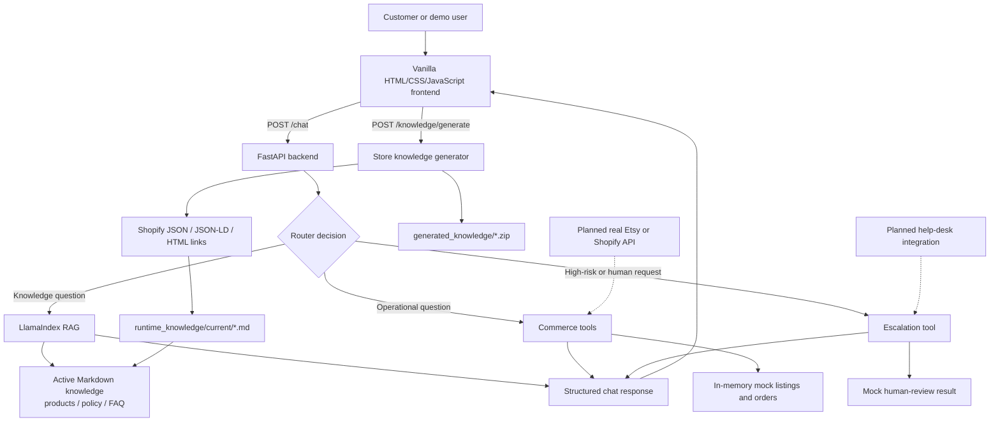

# Architecture

Status labels used in this document:

- **Implemented**: verified in the current repository.
- **Partially implemented**: a local or mock version exists, but the intended
  production capability does not.
- **Planned**: included in the project plan but not verified in the current
  repository.
- **TBD / needs verification**: not settled by the plan or repository.

## 1. System Overview

The current system is a small tool-augmented RAG application:

- A dependency-free browser frontend sends requests to FastAPI.
- A router chooses between commerce tools, LlamaIndex RAG, and escalation.
- OpenAI tool calling is used when configured; deterministic rules are the
  fallback.
- RAG reads Markdown store knowledge and returns answer text with source
  metadata.
- Commerce and escalation tools currently operate on mock in-memory data.
- Store knowledge can be generated from a public URL and activated at runtime.

The central design rule is that changing operational facts must come from
tools or provider APIs, while product education, policies, FAQs, and
recommendations may use RAG.

## 2. Architecture Diagram

## 3. Main Components

### Frontend

**Implemented:** `frontend/` contains a static chat interface built with HTML,
CSS, and JavaScript. It:

- accepts a store URL and calls the knowledge-generation endpoint;
- exposes a generated ZIP download;
- allows demo-data bypass;
- sends messages to `POST /chat`;
- displays intent labels, tool results, and RAG source snippets;
- allows an Etsy or Shopify platform label to be selected.

The project plan proposed React, Vite, and Tailwind. Those technologies are
**planned alternatives**, not current dependencies.

### Backend API

**Implemented:** `api.py` defines a synchronous FastAPI application with:

- `GET /health`;
- `POST /chat`;
- `POST /knowledge/generate`;
- `GET /knowledge/download/{artifact_id}`.

Pydantic models validate the main request and response structures. CORS is
limited to local frontend origins on port `5173`.

The plan mentioned `POST /upload`; no upload endpoint exists in the current
repository.

### LLM Layer

**Implemented:** OpenAI is the current LLM provider.

- Tool router model: `gpt-4o-mini`.
- RAG synthesis model: `gpt-4o-mini`.
- Embedding model: `text-embedding-3-small`.
- OpenAI Chat Completions tool calling selects structured tools.

The current tool router processes the first returned tool call. Multi-tool
planning and durable agent state are not implemented.

### RAG Layer

**Implemented:** `rag_service.py` uses LlamaIndex to load Markdown documents,
split them into nodes, build an in-memory vector index, retrieve relevant
nodes, and synthesise an answer.

The project plan proposed FAISS or Chroma. The current code uses LlamaIndex
`VectorStoreIndex` in process and does not configure either FAISS or Chroma.

### Knowledge Files

**Implemented:** checked-in demo knowledge lives in:

- `data/products.md`;
- `data/policy.md`;
- `data/faq.md`.

When runtime knowledge exists, it takes priority:

- `runtime_knowledge/current/products.md`;
- `runtime_knowledge/current/policy.md`;
- `runtime_knowledge/current/faq.md`.

Runtime knowledge and generated download artifacts are ignored by Git.

### Store Knowledge Generator

**Implemented:** `store_knowledge.py` performs deterministic extraction. It
tries:

1. Shopify `products.json`;
2. product JSON-LD;
3. product or listing links found in HTML;
4. linked policy and contact pages.

Missing fields remain `Not specified`. The checked-out branch returns an error
when the store page cannot be fetched. A separate `pr-7` / `pr-9` branch
contains more tolerant placeholder-and-warning behaviour; that behaviour is
not implemented on the current checkout.

### Tool / API Layer

**Partially implemented:** `commerce_api.py` defines contracts for:

- listing count;
- order lookup;
- human escalation.

The listing and order values are in-memory mocks. Selecting `etsy` or
`shopify` changes the platform field in the response but does not invoke a
provider API.

### Human Handoff / Escalation

**Partially implemented:** routing and a structured escalation result exist.
The tool does not create a ticket, send an email, persist a case, or notify a
person.

### Configuration and Environment Variables

**Implemented:**

- `OPENAI_API_KEY` enables OpenAI calls and is required for RAG.
- `AGENT_ROUTER=rules` forces deterministic routing.
- If `OPENAI_API_KEY` is absent, the router falls back to rules, although RAG
  requests still require OpenAI.
- `window.AGENT_API_URL` can override the frontend API base URL.

Local secrets belong in `.env`, which is ignored by Git.

## 4. Data Flow

### Chat request

1. The frontend sends `{message, platform}` to `POST /chat`.
2. `api.py` passes the request to `answer_message()`.
3. `agent_router.py` selects:
   - OpenAI tool calling when the router mode is `openai` and an API key is
     present;
   - deterministic rules otherwise.
4. The request follows one route:
   - listing count tool;
   - order-status tool;
   - escalation tool;
   - RAG.
5. FastAPI returns:
   - `intent`;
   - `answer`;
   - optional `tool_result`;
   - zero or more `sources`.
6. The frontend renders the customer-facing answer and optional diagnostic
   details.

### Knowledge-generation request

1. The frontend submits a store URL to `POST /knowledge/generate`.
2. `store_knowledge.py` validates and fetches the URL.
3. Product and policy information is extracted where available.
4. Three Markdown files are rendered.
5. A ZIP artifact is created under `generated_knowledge/`.
6. The Markdown files are copied into `runtime_knowledge/current/`.
7. The cached RAG query engine is cleared.
8. Future RAG requests rebuild the in-memory index from runtime knowledge.

## 5. RAG Flow

### Knowledge location

`get_knowledge_files()` first checks `runtime_knowledge/current/*.md`. If that
directory has no Markdown files, it falls back to `data/*.md`.

### Loading

`SimpleDirectoryReader` loads the selected Markdown files.

### Chunking

`TokenTextSplitter` creates nodes with:

- chunk size: 256 tokens;
- overlap: 20 tokens.

This splitter was selected to avoid runtime NLTK downloads.

### Embeddings and indexing

`OpenAIEmbedding(model="text-embedding-3-small")` creates embeddings.
`VectorStoreIndex` builds an in-memory index. The index is process-local and is
not persisted.

### Retrieval and answer generation

The query engine uses `similarity_top_k=2`. LlamaIndex retrieves source nodes
and uses `gpt-4o-mini` for answer synthesis. The API returns each source node's
file name, file path, and text.

### Grounding expectations

- Answers should rely on retrieved store knowledge.
- Missing facts must not be invented.
- Source metadata must remain available to callers.
- Strict citation enforcement, retrieval confidence thresholds, refusal
  policies, and an automated RAG evaluation suite are **planned or TBD**, not
  implemented.

## 6. Tool Calling / API Flow

### Questions that should use tools or APIs

- Active listing or product counts.
- Order existence and status.
- Carrier, tracking number, and estimated delivery.
- Future live inventory, pricing, fulfilment, or shop-state data.
- Explicit human escalation actions.

These values are changing operational facts and should not be inferred from
RAG documents.

### Questions that should use RAG

- Shipping and return policies.
- FAQs.
- Product descriptions and materials when present in store knowledge.
- Product suitability and recommendations grounded in available knowledge.

### Currently implemented tools

- `get_listing_count(platform)`
- `get_order(order_id, platform)`
- `escalate_to_human(reason, platform)`

The OpenAI router exposes these as JSON function schemas. The rules fallback
selects equivalent routes through keyword and order-number matching.

### Planned tools and integrations

The project plan proposed mock or real forms of:

- `get_order(order_id)`;
- `get_listing(product_id)`;
- `get_shop_info()`.

Only order lookup and listing count are currently represented. A listing-detail
tool, shop-information tool, and real Etsy/Shopify adapters remain
**planned**.

## 7. File and Directory Responsibilities

| Path | Current responsibility |
|---|---|
| `api.py` | FastAPI app, schemas, CORS, chat, knowledge generation, and ZIP download |
| `app.py` | Interactive command-line entry point |
| `agent_router.py` | Rules router and selection between OpenAI and deterministic modes |
| `openai_tool_router.py` | OpenAI tool definitions, execution, and answer formatting |
| `commerce_api.py` | In-memory mock listings, orders, and escalation result |
| `rag_service.py` | LlamaIndex document loading, splitting, indexing, retrieval, and sources |
| `store_knowledge.py` | Store URL fetching, extraction, Markdown rendering, and ZIP creation |
| `data/` | Checked-in fallback product, policy, and FAQ knowledge |
| `runtime_knowledge/` | Ignored active runtime knowledge generated from a store URL |
| `generated_knowledge/` | Ignored Markdown and ZIP download artifacts |
| `frontend/index.html` | Setup and chat page structure |
| `frontend/app.js` | Frontend state, API requests, chat rendering, and demo prompts |
| `frontend/styles.css` | Responsive frontend styling |
| `requirements.txt` | Pinned Python dependencies |
| `pyproject.toml` | Project metadata and Python version requirement |
| `README.md` | Public overview and local run instructions |
| `AGENTS.md` | Persistent working rules for Codex agents |
| `docs/CONTEXT.md` | Detailed repository handoff context |
| `docs/current-checkpoint.md` | Compact thread and work checkpoint |
| `docs/decision-log.md` | Technical decisions and trade-offs |
| `docs/setup-notes.md` | Environment, run, test, and troubleshooting notes |
| `docs/tickets/` | Historical implementation tickets |

There is no committed test suite, CI workflow, Dockerfile, or deployment
configuration in the current repository.

## 8. Current Implementation Status

### Implemented

- FastAPI API and local CORS configuration.
- Static frontend and four primary demo routes.
- OpenAI tool calling with a rules fallback.
- LlamaIndex RAG with source metadata.
- In-memory vector indexing.
- Split Markdown knowledge files.
- Store URL extraction and ZIP generation.
- Mock listing count, order lookup, and escalation contracts.

### Partially implemented

- Commerce integration: contracts exist, provider APIs do not.
- Human handoff: route exists, operational handoff does not.
- Store ingestion: works for supported public HTML/Shopify patterns but is not
  robust against all dynamic or protected stores.
- Grounding: sources are returned, but formal confidence checks and evaluation
  are absent.
- Error handling: basic API errors exist; tolerant fetch fallback lives only
  on another branch.

### Planned

- Real Etsy or Shopify API integration.
- Short demo video and polished portfolio demonstration.
- Product-detail and shop-information tools.
- Logging of tool calls and retrieval behaviour.
- Optional conversation memory.
- Live deployment.

### TBD / needs verification

- Provider priority and required API scopes.
- Production hosting and infrastructure.
- Authentication and multi-tenant design.
- Evaluation dataset, metrics, and acceptance thresholds.
- Confidence-based escalation behaviour.
- Whether or when a React frontend is justified.
- Whether LangGraph is needed for a future stateful workflow.

## 9. Technical Decisions

### Backend framework

FastAPI is **implemented**. It provides a small typed API surface and direct
integration with the Python routing and RAG code.

### RAG framework

LlamaIndex is **implemented**. It supplies document loading, token splitting,
OpenAI integrations, in-memory indexing, retrieval, and source nodes.

### LLM provider

OpenAI is **implemented** for tool routing, embeddings, and RAG answer
synthesis.

### Tool-calling approach

OpenAI Chat Completions function/tool calling is **implemented**, with a
deterministic rules fallback for local development and testing.

### Operational data versus RAG

The system deliberately separates changing commerce state from semantic
knowledge. This is the main architecture decision and must be preserved when
real provider integrations are added.

### LangChain and LangGraph

Neither LangChain nor LangGraph is installed or imported. The plan identifies
LangChain as optional. The current project keeps direct Python orchestration
because the workflow is small and explainable. LangGraph may become useful
only if future requirements introduce durable state, retries, approvals, or
multi-step workflows.

### Frontend framework

The plan suggested React, but the current MVP uses vanilla JavaScript to avoid
unnecessary build and framework complexity. React remains a future option, not
an implementation requirement.

## 10. Future Architecture / V2 Ideas

Relevant future improvements include:

- Replace mock commerce functions with real Etsy or Shopify adapters behind the
  existing tool contracts.
- Add a real help-desk or notification integration for escalation.
- Add a persistent vector database when data size, restart cost, or deployment
  topology requires it.
- Introduce structured conversation/session storage if multi-turn memory
  becomes a requirement.
- Add authentication, merchant isolation, rate limiting, and safer external
  URL ingestion.
- Add observability for routing decisions, tool calls, latency, retrieval
  results, and failures.
- Build an evaluation suite for routing accuracy, retrieval quality,
  faithfulness, and insufficient-evidence behaviour.
- Add CI and deployment configuration.
- Consider LangGraph only if the agent becomes a genuinely stateful,
  multi-step workflow.
- Consider React only if frontend complexity outgrows the current static
  implementation.

## Source Basis

- Planned architecture and roadmap:
  [Project 2: Etsy AI Agent System](https://app.notion.com/p/37f606dee5e680e1a230d2d0e7cf74aa)
- Implemented architecture: current repository source code, `README.md`,
  `AGENTS.md`, dependency files, and supporting documents under `docs/`.

